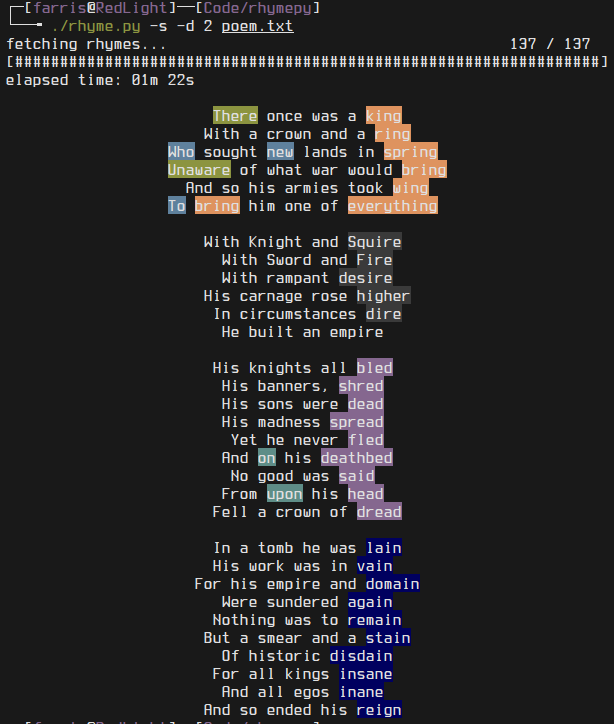

# rhymepy
A simple CLI program that highlights rhymes in a given text, using either the Datamuse API or the pronouncing module.

**Usage:**
```
usage: rhymepy [-h] [-l N | -a] [-p | -d {0,1,2}] file

required arguments:
  file                  a txt file

optional arguments:
  -h, --help            show this help message and exit
  -l N, --lines N       number of lines to match rhymes (default: 2)
  -a, --all-lines       match all lines

backends:
  -p, --pronouncing     use pronouncing as the backend for fetching rhymes
  -d {0,1,2}, --datamuse {0,1,2}
                        use datamuse as the backend for fetching rhymes. 0: match perfect rhymes. 1: match approximate rhymes. 2: match both
```

**Example:**



Poem by [voodooattack](https://github.com/voodooattack).

**Dependencies:**
* [requests](https://pypi.org/project/requests/)
* [pronouncing](https://pypi.org/project/pronouncing/) (optional)
* [colored](https://pypi.org/project/colored/) (temporary)

**TODO:**
* Rewrite the part that matches lines to skip over empty lines.
* Option to match each stanza.
* Make a config file for defaults and color palette.
* Make an install script.
* Add an option to match only last words in each line (rhyme scheme).
* Remove dependency on the `colored` module.
* If a word contains punctuation highlight only the word.
* (?) Remove empty lines and add a spacer in-between each line match block.
* ~~Add a color palette.~~
* ~~Loading bar if using Datamuse as a backend.~~
* ~~Center output text.~~
